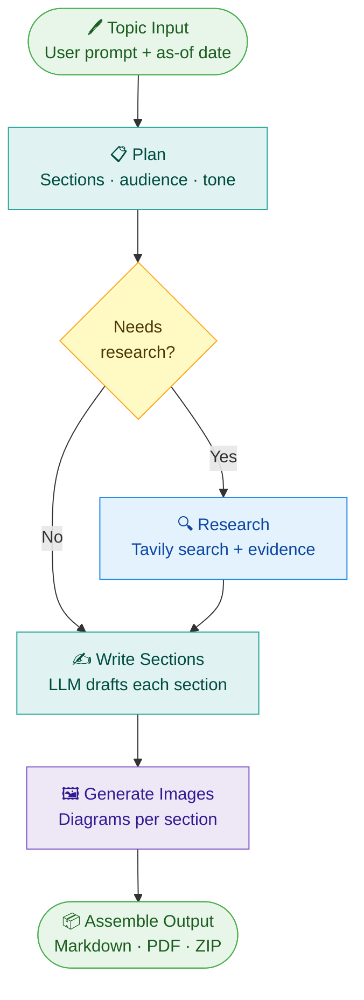

# 🧠 AI Blog Agent

[](https://www.python.org/)
[](https://streamlit.io)
[](https://github.com/langchain-ai/langgraph)
[](https://ai-agent-blog-system.onrender.com)
[](https://ai-agent-blog-system.onrender.com)
[](LICENSE)
[](https://github.com/dheeraj116232/Ai-agent-blog-system)

> A LangGraph-powered Streamlit application that generates structured, research-backed technical blog posts — complete with images, Markdown export, PDF export, and blog management.

🚀 **Live Demo:** [ai-agent-blog-system.onrender.com](https://ai-agent-blog-system.onrender.com)

---

## Overview

**AI Blog Agent** routes each generation through a multi-step LangGraph workflow: planning → optional web research → section writing → image planning → image generation → final Markdown assembly. The result is a polished, evidence-backed blog draft in seconds.

### Workflow Pipeline



> Each node is a discrete LangGraph state. The routing decision at **Needs research?** keeps closed-book drafts fast while enabling evidence-backed generation when needed.

---

## Features

| Feature | Description |
|---|---|
| 📝 **Blog Generation** | Generate complete blog drafts from a single topic prompt |
| 🔍 **Smart Research** | Automatically decides if web research is needed; uses Tavily for evidence |
| 🖼️ **Image Generation** | Generates technical diagrams or illustrative images per section |
| 👁️ **Markdown Preview** | Preview rendered output with locally referenced images |
| 📥 **Export Options** | Download as Markdown, PDF, or a ZIP bundle (Markdown + images) |
| 🗂️ **Blog Management** | View, load, and delete previously generated blogs |
| 📁 **Organized Outputs** | Per-blog image folders prevent cross-topic image contamination |

---

## Tech Stack

- **[Streamlit](https://streamlit.io)** — Web interface
- **[LangGraph](https://github.com/langchain-ai/langgraph)** — Stateful generation workflow
- **[Pydantic](https://docs.pydantic.dev)** — Structured data validation
- **[AWS Bedrock (Claude)](https://aws.amazon.com/bedrock/)** — Primary text generation (via `AWS_BEARER_TOKEN_BEDROCK`)
- **Image Generation** — Grok / Gemini / OpenAI (Eden can be wired via `EDEN_API_KEY`)
- **[Tavily](https://tavily.com)** — Optional web research for evidence-backed content
- **[Pillow](https://pillow.readthedocs.io)** — PDF export

---

## Project Structure

```
.
├── Backend.py        # LangGraph workflow, model routing, research, image generation
├── Frontend.py       # Streamlit UI, downloads, saved blog management
├── bwa_backend.py    # Thin import wrapper for the compiled graph app
├── database.py       # Blog persistence layer (load, save, delete)
├── requirements.txt  # Python dependencies
├── render.yaml       # Render deployment configuration (optional, for IaC deploys)
├── .gitignore        # Ignores secrets, logs, and generated outputs
└── README.md
```

> **Note:** Generated blog files and images are local runtime outputs and are Git-ignored.

---

## Setup

### 1. Create a virtual environment

**macOS / Linux**
```bash
python3 -m venv .venv
source .venv/bin/activate
```

**Windows (PowerShell)**
```powershell
python -m venv .venv
.\.venv\Scripts\Activate.ps1
```

### 2. Install dependencies

```bash
pip install -r requirements.txt
```

### 3. Configure environment variables

Create a `.env` file in the project root:

```env
TEXT_MODEL_PROVIDER=owl_alpha
IMAGE_MODEL_PROVIDER=grok_openrouter

OWL_ALPHA_API_KEY=sk-or-v1-...
OWL_ALPHA_MODEL=openrouter/owl-alpha

XAI_GROK_API_KEY=sk-or-v1-...
GROK_IMAGE_MODEL=x-ai/grok-imagine-image-quality

TAVILY_API_KEY=...        # Optional — enables research-backed generation
```

### 4. Run locally

```bash
python -m streamlit run Frontend.py
```

Open [http://localhost:8501](http://localhost:8501) in your browser.

---

## Configuration

### Text Generation

**Recommended (AWS Bedrock):**

```env
TEXT_MODEL_PROVIDER=bedrock
AWS_BEARER_TOKEN_BEDROCK=...
AWS_REGION_BEDROCK=ap-south-1
BEDROCK_TEXT_MODEL_ID=anthropic.claude-opus-4-7
```

**Supported providers:**

| Value | Notes |
|---|---|
| `bedrock` | Recommended; uses `AWS_BEARER_TOKEN_BEDROCK` |
| `owl_alpha` | Uses OpenRouter-compatible key |
| `grok` | xAI Grok via OpenRouter |
| `gemini` | Google Gemini |
| `openai` | OpenAI API |
| `local` | Local model server |
| `auto` | Tries configured providers; prefers Bedrock if available |

`OPENROUTER_API_KEY` is also supported as a fallback for Owl Alpha.

---

### Image Generation

**Recommended:**

```env
IMAGE_MODEL_PROVIDER=grok_openrouter
XAI_GROK_API_KEY=sk-or-v1-...
GROK_IMAGE_MODEL=x-ai/grok-imagine-image-quality
```

**Supported providers:** `grok_openrouter`, `xai`, `gemini`, `openai`, `auto`

> Official xAI keys via `GROK_API_KEY` or `XAI_API_KEY` are also supported, but this project defaults to OpenRouter-style keys.

---

## Outputs

After generation, the **Preview** tab provides:

- **Markdown download** — raw `.md` file
- **PDF download** — formatted PDF export
- **ZIP bundle** — Markdown + all generated images

Files are saved locally as:

```
<blog_slug>.md
images/<blog_slug>/
```

The **Past Blogs** panel lets you load or delete any previous blog. Deleting a blog also removes its associated image folder.

---

## Deploy to Render

This app is live at **[ai-agent-blog-system.onrender.com](https://ai-agent-blog-system.onrender.com)** using [Render](https://render.com).

### Steps

1. Push this repository to GitHub.
2. Go to [render.com](https://render.com) → **New → Web Service** → connect your GitHub repo.
3. Configure the service:

| Setting | Value |
|---|---|
| **Environment** | Python |
| **Build Command** | `pip install -r requirements.txt` |
| **Start Command** | `streamlit run Frontend.py --server.port $PORT --server.address 0.0.0.0` |

4. Add the following **Environment Variables** in the Render dashboard under **Environment**:

```env
TEXT_MODEL_PROVIDER=owl_alpha
IMAGE_MODEL_PROVIDER=grok_openrouter

OWL_ALPHA_API_KEY=sk-or-v1-...
OWL_ALPHA_MODEL=openrouter/owl-alpha

XAI_GROK_API_KEY=sk-or-v1-...
GROK_IMAGE_MODEL=x-ai/grok-imagine-image-quality

TAVILY_API_KEY=...
```

5. Click **Deploy** — Render will build and serve the app automatically on each push to your main branch.

> ⚠️ Never commit `.env` to version control. Always use Render's environment variable panel for secrets.

> 💤 **Free tier note:** Render free services spin down after inactivity. The first request after idle may take ~30 seconds to wake up.

---

## Troubleshooting

| Symptom | Fix |
|---|---|
| `localhost` refuses to connect | Restart with `python -m streamlit run Frontend.py` |
| OpenRouter connection error on text generation | Wait a moment and retry — the backend includes automatic retries for transient failures |
| Images look unrelated to current blog | Regenerate the blog — new outputs go into a fresh per-blog image folder |

---

## Security

- Store all API keys in `.env` locally or in Render's environment variable dashboard when deployed.
- Rotate any key that was accidentally exposed publicly.
- Do not commit generated logs or output files unless intentionally publishing samples.

---

## Git Hygiene

The repository ignores:

- `.env` and virtual environments
- Python cache (`__pycache__`, `*.pyc`)
- Streamlit logs
- Generated blog Markdown files
- Generated images

Before pushing, verify your working tree is clean:

```powershell
git status --short
```

---

## Contributing

Contributions are welcome! Here's how to get started:

1. Fork the repository and create a feature branch:
   ```bash
   git checkout -b feature/your-feature-name
   ```
2. Make your changes and ensure the app runs locally without errors.
3. Keep commits focused — one logical change per commit.
4. Open a pull request with a clear description of what you changed and why.

**Good areas to contribute:**
- New text or image model provider integrations
- Additional export formats (e.g. EPUB, DOCX)
- UI improvements or accessibility fixes
- Test coverage for the LangGraph workflow nodes
- Documentation improvements

Please open an issue first for large changes so we can discuss the approach before you invest the time.

---

## License

This project is licensed under the MIT License - see the [LICENSE](LICENSE) file for details.
